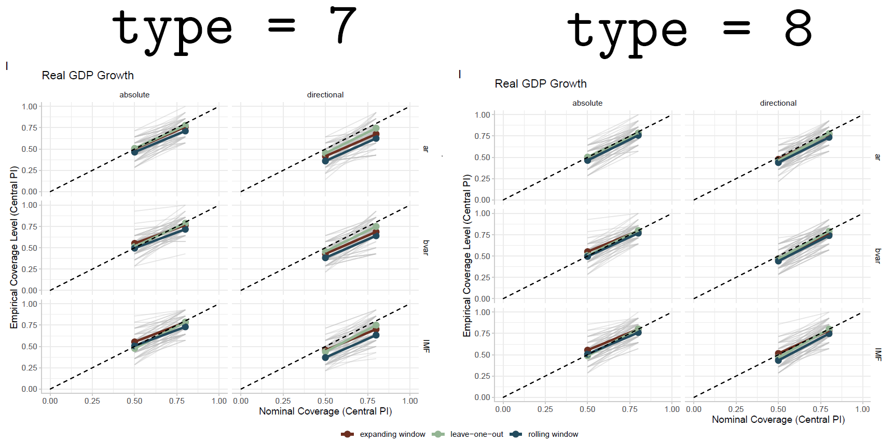
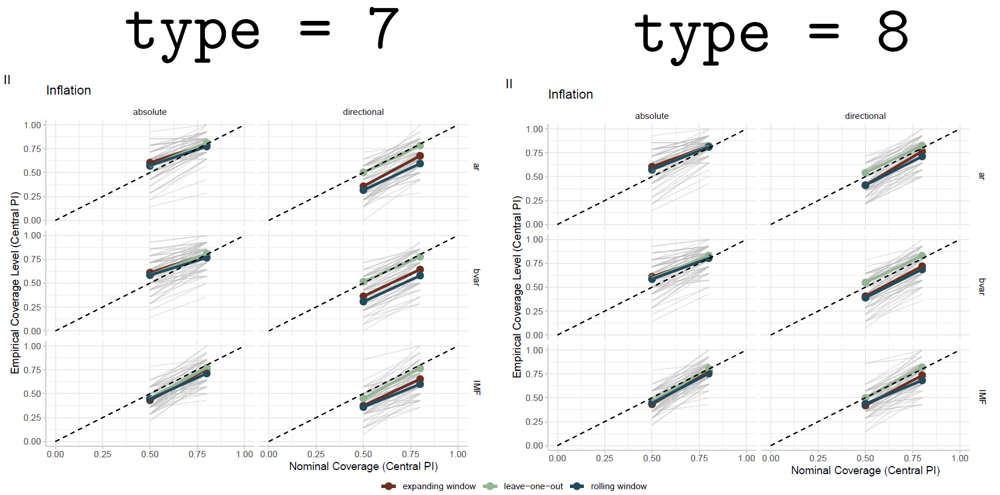

```{r setup, include=FALSE}
knitr::opts_chunk$set(echo = TRUE)
library(data.table)
library(here)
library(ggplot2)
library(MetBrewer)
.d <- `[`
devtools::load_all()
set.seed(42)
```

```{r simfunction, echo = FALSE}
qumeth <- c(1, 7, 8)

simcilength <- function(n, nits, lvl = 0.8, qumeth = c(1,7,8)){
  res <- vector(mode = "list", length = nits)
  res_cmp <- vector(mode = "list", length = nits)
  
  if(lvl == 0.8){
    upper <- 0.9
    lower <- 0.1
  } else if (lvl == 0.5){
    upper <- 0.75
    lower <- 0.25
  }
  
  for(i in 1:nits){
  
    resvec <- rep(NA, 2*length(qumeth))
    names(resvec) <- apply(expand.grid(c("absolute", "directional"), paste0("q", qumeth)), 1, paste, collapse="_")
  
    resvec_cmp <- rep(NA, length(qumeth))
    names(resvec) <- paste0("q", qumeth)
  
  
    dat <- rnorm(n = n)
  
  
    for(k in seq_along(qumeth)){
      resdir <-  quantile(dat, upper, type = qumeth[k]) - quantile(dat, lower, type = qumeth[k])
      resabs <-  2* quantile(abs(dat), type = qumeth[k], lvl)
      resvec[2*k - 1] <- resdir
      resvec[2*k] <- resabs
  
      resvec_cmp[k] <- (resabs - resdir) > 0
    }
  
    res[[i]] <- data.table(t(resvec))
    res_cmp[[i]] <- data.table(t(resvec_cmp))
  }
  res <- data.table::rbindlist(res)
  res_cmp <- data.table::rbindlist(res_cmp)
  names(res) <- apply(expand.grid(c("absolute", "directional"), paste0("q", qumeth)), 1, paste, collapse="_")
  names(res_cmp) <- paste0("q", qumeth)
  
  result <- apply(res_cmp, 2, mean) |> t() |> as.data.table()
  
  return(list(res, res_cmp, result))
}
```


```{r generate_data80, echo=FALSE}
nits <- 10000

valsn <- c(9, 21, 150, 5000)

simdat2 <- lapply(valsn, function(nval){
  simcilength(nval, nits, lvl = 0.8)[[3]] |>
  melt(measure.vars = paste0("q", c(1,7,8)), variable.name = "quantile_function",
       value = "proportion") |> 
  .d(,n := nval) |>
    .d(, quantile_function := factor(quantile_function,
                                        levels = c("q1", "q7", "q8"),
                                        labels = c("type = 1", "type = 7", "type = 8")))
  }
) |>
  rbindlist()

```


# Simulation results
For each run, we simulated $n$ observations from a standard normal distribution and subsequently calculated the following two interval lengths:
\begin{itemize}
\item $l_1 = Q \left((X_i)_{i=1}^{n}, 0.9\right) - Q\left((X_i)_{i=1}^{n}, 0.1\right) $ \quad \quad \quad "directional method"
\item $l_2 = 2 \cdot Q\left((|X_i|)_{i=1}^{n}, 0.8\right)$ \quad \quad \quad \quad \quad \quad \quad \quad \quad "absolute method"
\end{itemize}

where $(X_i)_{i=1}^{n}$ is the simulated data and $Q(\cdot, \tau)$ is the quantile function at level $\tau$. In a finite sample setting, there are different ways of calculating $Q$: we use methods 1, 7, 8 from the $\texttt{quantile()}$ function ($\texttt{type}$ argument). See short note at the bottom of this page.

In the previous IMF application, we have observed that $l_2$ is usually larger, using the default quantile calculation method $\texttt{type=7}$.

To investigate whether this is a more universal result, we simulate data with $n \in [7, 50000]$ (evenly spaced on a log scale) and $10000$ iterations each. For each $n$, we record the proportion of instances where $l_2 > l_1$, dependent on the quantile calculation method. The simulation results are shown in the plots on the following page, separately for the two confidence levels.

### Short note on the different types
The following is taken from (Hyndman & Fan 1996: \textit{Sample Quantile in Statistical Packages}). Fore more details, we refer to that text. 
\begin{itemize}
\item $\texttt{type = 1}$ does not interpolate between observations. As the inverse of the empirical distribution function, it always "jumps to the upper value". Thus, severe discontinuties can arise (see following plots)
\item $\texttt{type = 7}$ and $\texttt{type = 8}$ linearly interpolate between observed data points, but do so in different ways, i.e. they choose different midpoints between different values for the cumulative probabilities (see Hyndman)
\end{itemize}

\newpage


## For confidence level 80%
```{r read80data}
simdat <- data.table::fread(here("simulations", "results", "simdat_props80.csv"))
```

```{r, echo = FALSE, fig.dim=c(7,3.8)}
ggplot(aes(x = n, y = proportion, color = quantile_function, group = quantile_function), data = simdat) +
  geom_line() +
  geom_hline(aes(yintercept = 0.5), linetype = "dashed") +
  scale_color_met_d("Archambault") +
  scale_x_continuous(trans='log2') +
  ggtitle("Prop. of longer intervals in absolute method, depending on type option in quantile()") +
  ylab("proportion of absolute intervals larger") +
  xlab("number of simulated observations") +
  theme_uqimf()
```


```{r, echo = FALSE}
ggplot(aes(x = quantile_function, y = as.factor(n), fill = proportion), data = simdat2) +
  geom_tile() +
  geom_text(aes(label=proportion)) +
  ylab("number of observations") +
  xlab("Interpolation method (q_'x' corresponds to type = 'x' in quantile() function)") +
  theme_uqimf()
```

\vspace{0.5cm}

## For confidence level 50%
```{r generate_data50, echo=FALSE, eval = FALSE}

valsn <- exp(seq(2,10, by = 0.05)) |> floor() |> as.list()

simdat <- lapply(valsn, function(nval){
  simcilength(nval, nits, lvl = 0.5)[[3]] |>
  melt(measure.vars = paste0("q", c(1,7,8)), variable.name = "quantile_function",
       value = "proportion") |> 
  .d(,n := nval) |>
    .d(, quantile_function := factor(quantile_function,
                                        levels = c("q1", "q7", "q8"),
                                        labels = c("type = 1", "type = 7", "type = 8")))
  }
) |>
  rbindlist()

```

```{r read50data}
simdat <- data.table::fread(here("simulations", "results", "simdat_props50.csv"))
```


```{r, echo = FALSE, fig.dim=c(7,3.8)}
ggplot(aes(x = n, y = proportion, color = quantile_function, group = quantile_function), data = simdat) +
  geom_line() +
  geom_hline(aes(yintercept = 0.5), linetype = "dashed") +
  scale_color_met_d("Archambault") +
  scale_x_continuous(trans='log2') +
  ggtitle("Prop. of longer intervals in absolute method, depending on type option in quantile()") +
  ylab("proportion of absolute intervals larger") +
  xlab("number of simulated observations") +
  theme_uqimf()
```


We observe that the relative length of the two interval methods vastly differs between the 3 types. $\texttt{type = 1}$ is highly discontinuous and "switches around" substantially with rising $n$. The two interpolating types $\texttt{type = 7}$ and $\texttt{type = 8}$ both approach $0.5$ with increasing $n$. Importantly, for $\texttt{type = 8}$, the interval lenghts for the two methods are overall closer to $0.5$ and thus more balanced. 

# What does this mean for the IMF project

So far, we used $\texttt{type = 7}$, the default for the $\texttt{quantile()}$ function - here, in $\sim 80$ percent of cases for both the $50$% and $80$% interval, the absolute method produced longer intervals. We reran the analysis for $\texttt{type = 8}$ - now this is only the case for $\sim 60$ percent of cases.

Importantly, the coverage improves slightly for the directional method and coverage rates are closer to nominal levels (coverage for the absolute method specifically remain mostly unchanged).

More detailed investigation should perhaps be done, but I think this could be a real argument for using $\texttt{type = 8}$ interpolation method and, additionally, perhaps considering changing to directional errors as a default after all.

(Scores overall and in particular ordering between forecast sources also remain mostly the same, so are not included here.) 


## GDP Growth


## Inflation

